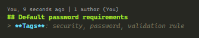

# Tips and tricks
Multiple **tips and tricks** that can make the work easier when using different languages, frameworks or libraries.  

I just created this repository with the purpose to add one tip or trick each day of this year and save them all together and use it as a personal dictionary.

# Index

- [php](php)
  - [Laravel](php/laravel)
- [JavaScript](js)
  - [Operators](js/operators.md)

# Contributing
**Contributing it's open for anyone!**  
Feel free to fork this project and add your tips and tricks (or modify/mark as depprecated existing ones), just make sure to follow some basic rules.  

### Where you should add new tips
You should add the new tips in the correct place, example: 
```
If you have a Laravel tip just follow this
Small tip?          -> Add it to the small tips file       -> php/laravel/small-tips.md  
Longer tip?         -> Feel free to create a file          -> php/laravel/tip-name.md  
Multiple files tip? -> Create a folder for all the content -> php/laravel/tip-name/your-content.md
```
Also please ensure that any indications added to the tip are explained in **english**. 

### Language, content and tags
Any explanations for the tips and tricks should be in **english**.  
You can add any images, videos, mermaid diagrams or w/e you think is useful to explain the trick as long as you stick to markdown usage.  
If needed, you can store any used images in the **img** folder (feel free to create subfolders if you need it).  

Also it is recommended to add some tags right after the tip title, for example:  
  

### Commit names
Try to make it as clear as possible, example:  
`Added Laravel small tip: password default requirements`