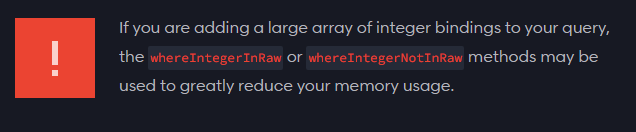

# Small tips
Here you'll find small and concise but powerful tips. Feel free to explore them!  

- [Override the orderBy defined in relationships (reorder)](#override-the-orderby-defined-in-relationships-reorder)
- [Default password requirements](#default-password-requirements)
- [Loop variable in Blade](#loop-variable-in-blade)
- [Report to log long queries](#report-to-log-long-queries)
- [Collection: Remove certain records by primary key](#remove-certain-records-by-primary-key-from-a-collection)
- [OrderByRaw](#orderbyraw)
- [WhereIntegerInRaw](#whereintegerinraw)

## Override the orderBy defined in relationships (reorder)
> **Tags**: eloquent, data, relationship, orm

If you have a relationship between models you can define the orderBy rule that will sort the loaded data. But did you know you can override that orderBy whenever you need it?

```php
// Define the relationship in app\Models\User.php
public function posts(): HasMany
{
    return $this->hasMany(Post::class)
                ->orderBy('id', 'desc'); // <- will be the default orderBy
}

// Then load the user posts in the controller or view
Auth::user()->posts()->get(); // <- use the default orderBy
// Or
Auth::user()->posts()->reorder('id', 'asc')->get(); // <- override the default orderBy
```


## Default password requirements
> **Tags**: security, password, validation rule  
> **Version**: Laravel v8.39 or superior

```php
// Add the configuration in a service provider
// File: app/Providers/AppServiceProvider.php
use Illuminate\Support\ServiceProvider;
use Illuminate\Validation\Rules\Password;

class AppServiceProvider
{
    public function boot(): void
    {
        // Configure default requirements for password
        Password::defaults(function () {
            return Password::min(8) // at least 8 characters
                ->letters() // at least one letter
                ->numbers() // at least one number
                ->symbols() // at least one symbol
                ->mixedCase() // at least one uppercase and one lowercase letter
                ->uncompromised(); // has not been compromised in data leaks
        });
    }
}


// Then when you need it in the controller or the form request add the rule
$request->validate([
  ['password' => ['required', Password::defaults()]],
]);
```
**Note:** the `uncompromised()` method checks the password against a verification API to see if the password appears in data leaks. It uses the [NotPwnedVerifier](https://github.com/laravel/framework/blob/9.x/src/Illuminate/Validation/NotPwnedVerifier.php) implementation which checks password leaks using [Have I Been Pwned API](https://haveibeenpwned.com/API/v3). It was implemented in Laravel v8.39.


## Loop variable in Blade
> **Tags**: blade, view, loop  

When you have a collection that you want to print into the view, you use the Blade's `foreach` directive.  
```php
@foreach ($posts as $post)
    <div class="post">
        <h2>{{ $post->title }}</h2>
        <p>{{ $post->description }}</p>
    <div>
@endforeach
```
What you might don't know is that **inside Blade's foreach directive, you can use the `$loop` variable**, which has some cool values
```php
$loop->index // Index of the current loop iteration (starts at 0)
$loop->remaining // The remaining iterations in the loop
$loop->first
$loop->last
$loop->even
$loop->odd

// And also, if you're nesting loops
$loop->parent // the parent's loop variable
// For example:
$loop->parent->first
```
And there are more! [You can check them in the documentation.](https://laravel.com/docs/9.x/blade#the-loop-variable).  

So now, for example you could add some styles using [Blade's conditional classes](https://laravel.com/docs/9.x/blade#conditional-classes) and even if you show a list of posts and its comments and only want to add custom styles for first post's comments, you could do it easily!  
```php
@foreach ($posts as $post)
    <div @class([
        'post', 
        'first-post' => $loop->first, 
        'even-post' => $loop->even
    ])>
        <h2>{{ $post->title }}</h2>
        <p>{{ $post->description }}</p>
        @foreach($posts->comments as $comment)
                <div @class([
                    'comment', 
                    'first-post-comments' => $loop->parent->first, 
                ])>
                    <h3>{{ $comment->author }}</h3>
                    <p>{{ $comment->message }}</p>
                </div>
        @endforeach
    </div>
@endforeach
```


## Report to log long queries
> **Tags**: log, report, query

If you want to log a query in case this query takes a long time to run, you can do it by listening to the Database. Also, if you want to listen for the cumulative time of the queries for current request, you can also do it.
```php
// Add the configuration in a service provider
// File: app/Providers/AppServiceProvider.php
use Illuminate\Support\ServiceProvider;
use Illuminate\Support\Facades\DB;
use Illuminate\Support\Facades\Log;
use Illuminate\Database\Events\QueryExecuted;
use Illuminate\Database\Connection;

class AppServiceProvider
{
    public function boot(): void
    {
        // Log a warning if any query takes more than 1 second
        DB::listen(function ($query) {
            if ($query->time > 1000) {
                Log::warning("Long query detected.", [
                    'sql' => $query->sql,
                    'duration' => $query->time,
                ]);
            }
        });

        // Log a warning if cumulative queries for active request take more than 5 seconds
        DB::whenQueryingForLongerThan(5000, function (Connection $connection, QueryExecuted $event) {
            Log::warning("Database queries exceeded 5 seconds", [
                'name' => $connection->getName(),
                'total_duration' => $connection->totalQueryDuration(),
            ]);

            // Or notify the development team...
        });
    }
}
```

> **Note:** by default logs are saved into **storage/logs/laravel.log**

## Remove certain records by primary key from a collection
> **Tags**: collection, eloquent

If you want to retrieve records from database but you want to exclude some records in specific and you know those records id, this method may be useful for you.  
Imagine the first 3 posts you created in your application where autogenerated and used as an example and you don't want to retrieve them but neither store them in a different table. You could exclude them with **`except`** method.  
```php
// Retrieve all published posts
$posts = Post::where('published', 1)->get();

// Exclude the posts with IDs 1, 2 and 3
$posts->except([1, 2, 3]);
```

[Found this method interesting? Check out the whole collection method list!](https://laravel.com/docs/9.x/collections#available-methods)


## OrderByRaw
> **Tags**: eloquent, query, raw sql  

You can order the results with `orderBy('column')`, but did you know you can use raw database sentences? This example created by [**Cosme Escobedo**](https://twitter.com/cosmeescobedo/status/1612492772367339529) shows **how to sort tasks by how long before the due date they were completed**.
```php
$tasks = Task::query()
            ->whereNotNull('completed_at')
            ->orderByRaw('due_at - completed_at DESC')
            ->get();
```

The method [`orderByRaw`](https://laravel.com/docs/9.x/queries#orderbyraw) lets us the developers to order the data using more complex sentences than just order by a column.


## WhereIntegerInRaw
> **Tags**: eloquent, query, raw sql, performance  

Another raw database sentence you can use in order to gain some sexy performance for your application is the methods **`whereIntegerInRaw`** and **`whereIntegerNotInRaw`**. This will be useful when you want to filter a query and the column holds integer values.
```php
// This way works fine
Product::whereIn('id', range(1, 100))->get();

// But this way has faster performance! ✅
Product::WhereIntegerInRaw('id', range(1, 100))->get();
```

The official Laravel documentation points this out  
